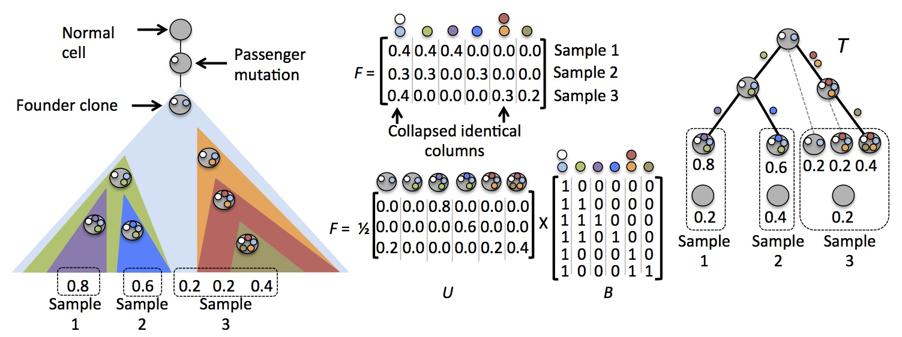

#AncesTree

##About
AncesTree is an algorithm that infers the clonal evolution and tumor composition, including mixing fractions, of a tumor from multi-sample DNA sequence data.

##Downloads 
You can download the latest version of AncesTree from the [AncesTree GitHub project](https://github.com/raphael-group/AncesTree).

##Support
For support, please see the [AncesTree Google Group](https://groups.google.com/forum/#!forum/ancestree).

##References
AncesTree is described in the following publications:

>M. El-Kebir, L. Oesper, H. Acheson-Field, and B.J. Raphael.
>Reconstruction of clonal trees and tumor composition from multi-sample sequencing data
>*Bioinformatics (Special Issue: Proceedings of ISMB)*, (2015) 31(12):i62-i70.

