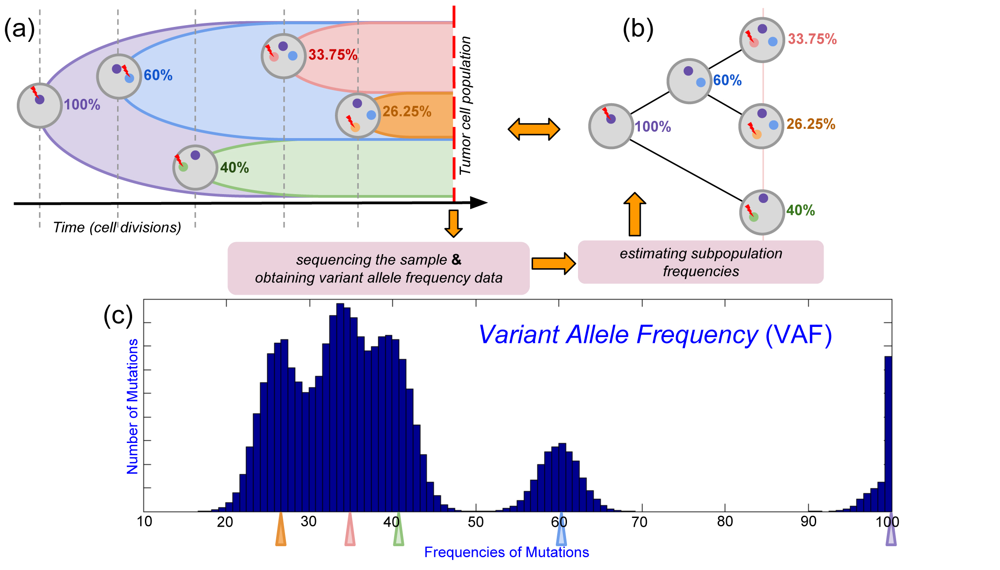

#BTP: Binary Tree Partition -- analyzing intra-tumor heterogeneity from high-throughput sequencing data

##About
Binary Tree Partition (BTP) is a novel combinatorial formulation of the problem of constructing the subpopulations of tumor cells from the variant allele frequencies of somatic mutations. 

##Downloads 
You can download the latest version of rec-BTP from [rec-BTP version 1.0](http://compbio-research.cs.brown.edu/software/BTP/rec-btp-1.0.tar.gz).

##References
The algorihtm is described in the following publications:

>A combinatorial approach for analyzing intra-tumor heterogeneity from high-throughput sequencing data
>I Hajirasouliha, A Mahmoody, BJ Raphael
>Bioinformatics 30 (12), i78-i86

