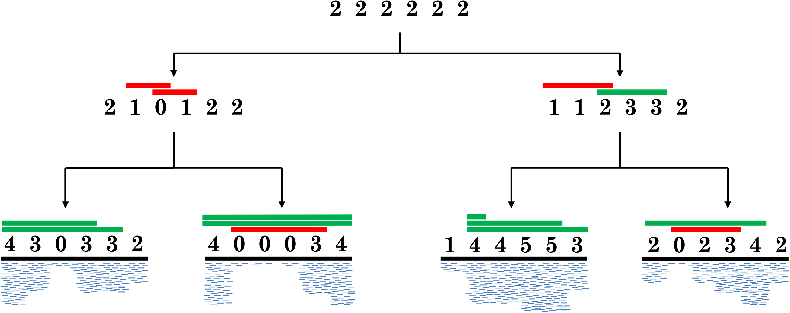

# CNT-ILP: Copy-Number Tree

## About
The software implements a integer-linear program (ILP) for solving the Copy-Number Tree (CNT) problem. This problem aims to infer the copy-number tree of minimum cost from the copy-number profiles of distinct tumor clones. More specifically, a copy-number tree is a tree describing the evolution of the tumor clones such that each node corresponds to the copy number profile of a clone and the edge are labeld by interval events. An interval event is an event that either increase or decrease the copy numbers of consecutive genomic segments by 1 and they are used to describe the effects of CNAs on multiple segments.

Fig. As input we are given the copy-numberproles of four leaves, each prole is an integer vector that is inferred from data;e.g. the coverage of mapped reads (blue segments). The tree topology and prolesat internal vertices are found to minimize the total number of amplications(green bars) and deletions (red bars). The displayed scenario has 14 total event

## Downloads 
You can download the latest version of CNT-ILP from the [CNT-ILP GitHub project](https://github.com/raphael-group/CNT-ILP).

## Support
A related google group will be available soon.

## References
CNT-ILP is described in the following publications:

>El-Kebir, Mohammed, Benjamin J. Raphael, Ron Shamir, Roded Sharan, Simone Zaccaria, Meirav Zehavi, and Ron Zeira.
>Complexity and Algorithms for Copy-Number Evolution Problems
>AMB, 2017, in press.

>El-Kebir, Mohammed, Benjamin J. Raphael, Ron Shamir, Roded Sharan, Simone Zaccaria, Meirav Zehavi, and Ron Zeira.
>Copy-Number Evolution Problems: Complexity and Algorithms.
>WABI 2016: 137-149

