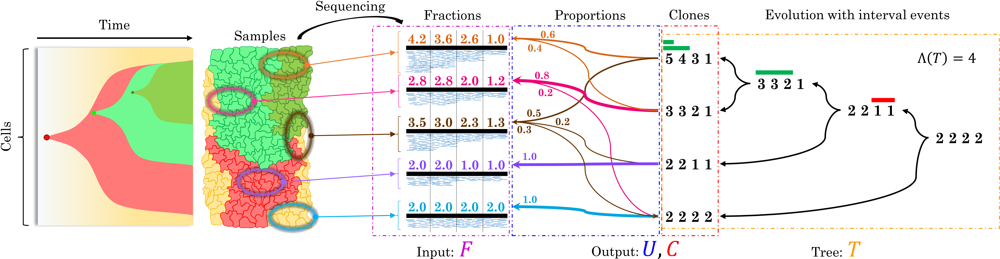

# CNT-MD: Copy-Number Tree Mixture Deconvolution

## About
We introduce an approach that aims to infer the copy-number profiles (used to identify the corresponding CNAs) of distinct tumor clones and their evolution from fractional copy numbers obtained from multi-sample bulk sequencing data. In particular, the evolution of the tumor clones is described as a copy-number tree where each node corresponds to the copy number profile of a clone and the edge are labeld as interval events. An interval event is an event that either increase or decrease the copy numbers of consecutive genomic segments by 1 and they are used to describe the effects of CNAs on multiple segments. The approach is formally encoded as the CNTMD problem that jointly aims to perform two tasks:
1. To factorize the fractional copy numbers into the copy numbers of distinct clones and the corresponding proportions in the input samples.
2. To infer the evolution of the clones define by such inferred copy numbers and defined by a copy-number tree, under a principle of parsimony.
The related software implements a coordinate-descent algorithm for solving this problem.

Fig. A tumor consists of heterogeneous subpopulations of cells, or clones. The normal clone is colored yellow. Five samples are bulk sequenced yielding fractional copy numbers F.
We model the evolution of CNAs by a copy-number tree T (right). We combine the deconvolution of F with the inference of T . Thus, CNTMD factors F into the integer copy numbers C of the extant clones and their proportions U such that F = CU and C generates a copy-number tree T with the minimum number Λ(T) of interval events.

## Downloads 
You can download the latest version of CNT-MD from the [CNT-MD GitHub project](https://github.com/raphael-group/CNT-MD).

## Support
A related google group will be available soon.

## References
CNT-MD is described in the following publications:

>Simone Zaccaria, Mohammed El-Kebir, Gunnar W. Klau, Benjamin J. Raphael:
>The Copy-Number Tree Mixture Deconvolution Problem and Applications to Multi-sample Bulk Sequencing Tumor Data.
>RECOMB 2017: 318-335

