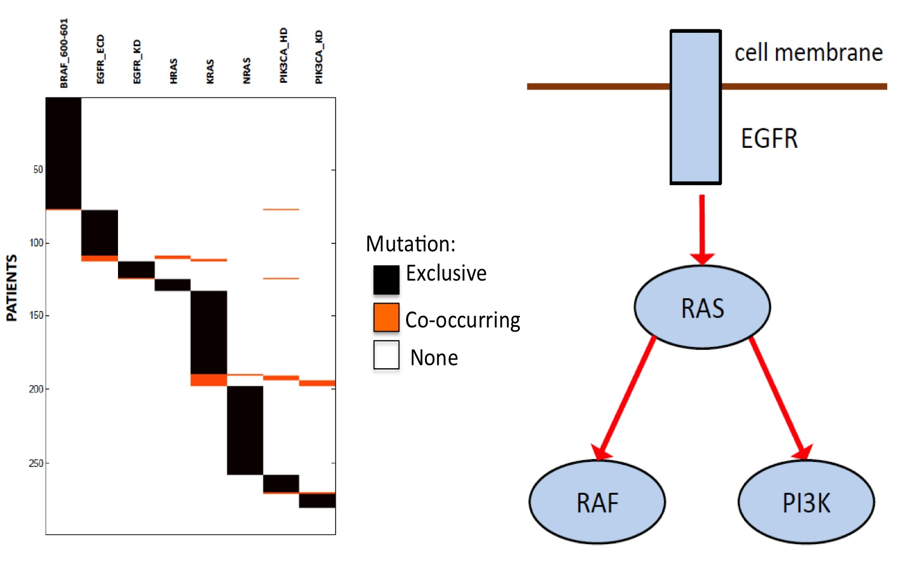

#Dendrix

##About
Dendrix (_De_ _no_vo _Dri_ver E_x_clusivity) is an algorithm for discovery of mutated driver pathways in cancer using only mutation data. It finds sets of genes, domains, or nucleotides whose mutations exhibit both high coverage and high exclusivity in the analyzed samples. 

**People** (strict random order): Fabio Vandin, Hsin-Ta Wu, Eli Upfal, Ben Raphael.

##Downloads

* Latest release: [ver0.3, February 4, 2013](http://bio.cs.brown.edu/software/Dendrix/Dendrix_v0.3.zip)
* Visualization: [Cytoscape plugin](http://bio.cs.brown.edu/software/HotNet/HotNetCytoscape.tar.gz)

##Support
Detailed instructions for running Dendrix are provided in the README.txt file in the release above.

For additional support, contact dendrix [at] cs.brown.edu.

##References
The Dendrix algorithm is described in the following publications:

>F. Vandin, E. Upfal, and B.J. Raphael. (2011)
>De Novo Discovery of Mutated Driver Pathways in Cancer. (Abstract)
>*Proceedings of the 15th Annual International Conference on Research in Computational Molecular Biology (RECOMB 2011)*, pag:499-500.

>F. Vandin, E. Upfal, and B.J. Raphael.
>De novo discovery of mutated driver pathways in cancer.
>*Genome Research* (2011) Jul 11. [[PDF](http://compbio.cs.brown.edu/publications/papers/VandinUpfalRaphael_GR_Dendrix.pdf) | [Publisher link](http://dx.doi.org/10.1101/gr.120477.111)]