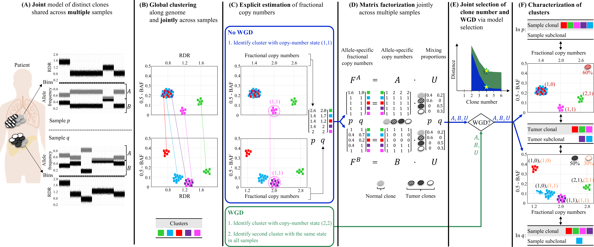

# HATCHet: Holistic Allele-specific Tumor Copy-number Heterogeneity

HATCHet is an algorithm to infer allele and clone-specific copy-number aberrations (CNAs), clone proportions, and whole-genome duplications (WGD) for several tumor clones jointly from multiple bulk-tumor samples of the same patient or from a single bulk-tumor sample. HATCHet has been designed and developped by Simone Zaccaria in the group of prof. Ben Raphael at Princeton University. The full description of the algorithm, the comparison with previous state-of-the-art methods, and its application on published cancer datasets are described in

[Simone Zaccaria and Ben Raphael, 2018](https://www.biorxiv.org/content/early/2018/12/17/496174)

The simulated data, the results of all the methods considered in the comparison, the results of HATCHet on the published whole-genome multi-sample tumor sequencing datasets ([(Gundem et al., *Nature*, 2015)](...) and [(Makohon-Moore et al., *Nature genetics*, 2017)](...)) and all the related analyses are available at

[manuscript's data](https://github.com/raphael-group/hatchet-paper)

**Overview of HATCHet algorithm.**
**(A)** HATCHet analyzes the read-depth ratio (RDR) and the B-allele frequency (BAF) in bins of the reference genome (black squares) jointly from multiple tumor samples. Here, we show two tumor samples *p* and *q*. **(B)** HATCHet globally clusters the bins based on RDR and BAF along the entire genome and jointly across samples *p* and *q*. Each cluster (color) includes bins with the same copy-number state within each clone present in *p* or *q*. **(C)** HATCHet estimates the fractional copy number of each cluster. If there is no WGD, the identification of the cluster (magenta) with copy-number state _(1, 1)_ is sufficient and RDRs are scaled correspondingly. If a WGD occurs, HATCHet finds the cluster with copy-number state _(2, 2)_ (same magenta cluster) and a second cluster having an identical copy-number state in all tumor clones. **(D)** HATCHet factorizes the allele-specific fractional copy numbers *F^A, F^B* into the allele-specific copy numbers *A, B*, respectively, and the clone proportions *U*. Here there is a normal clone and 3 tumor clones. **(E)** HATCHet's model selection criterion identifies the matrices *A*, *B* and *U* in the factorization while evaluating the fit according to both the inferred number of clones and presence/absence of a WGD. **(F)** Clusters are classified by their inferred copy-number states in each sample. *Sample-clonal clusters* have a unique copy-number state in the sample and correspond to evenly-spaced positions in the scaled RDR-BAF plot (vertical grid lines in each plot). *Sample-subclonal clusters* (e.g. cyan in *p*) have different copy-number states in a sample and thus correspond to intermediate positions in the scaled RDR-BAF plot. *Tumor-clonal clusters* have identical copy-number states in all tumor clones -- thus they are sample-clonal clusters in every sample and preserve their relative positions in scaled-RDR-BAF plots. In contrast, *tumor-subclonal clusters* have different copy-number states in different tumor clones and their relative positions in the scaled RDR-BAF plot varies across samples (e.g. purple cluster).

## Repository 

You can download the latest version of HATCHet from the [HATCHet GitHub project](https://github.com/raphael-group/hatchet). The repository includes a detailed documentation, demos, examples, tutorials, guides, and recommentations for usage.

## Support

You can ask support and questions about HATCHet on the actively mantained **Issues** forum of the HATCHet GitHub project](https://github.com/raphael-group/hatchet). 

## References
HATCHet and its applications are described in the following publications:

> Simone Zaccaria and Benjamin J. Raphael, *Accurate quantification of copy-number aberrations and whole-genome duplications in multi-sample tumor sequencing data*. bioRxiv (Dec. 17, 2018) doi.org/10.1101/496174
