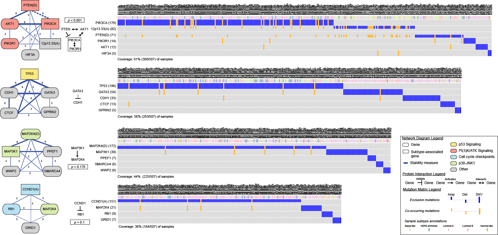

# Multi-Dendrix

## About
Multi-Dendrix (_Multi_ple Pathways _De_ _no_vo _Dri_ver E_x_clusivity) is an algorithm that identifies sets of driver pathways in cancer without prior information by simultaneously identifying sets of genes with approximately exclusive mutations and high coverage. You can view the results of Multi-Dendrix applied to TCGA data at the following link: [http://compbio-research.cs.brown.edu/projects/multi-dendrix/results/](http://compbio-research.cs.brown.edu/projects/multi-dendrix/results/).

The Multi-Dendrix Python package includes the Multi-Dendrix algorithm, as well as additional functions for:

1. identifying the stable modules identified by Multi-Dendrix over a range of parameter values;
2. analyzing (sub)type-specific mutations in a cohort of samples; and,
3. calculating protein-protein interaction enrichment of gene sets and collections of gene sets.

<i style="font-size:80%">
	A collection of gene sets identified by Multi-Dendrix from mutation data in 202 genes from
	<a href="http://www.nature.com/nature/journal/v490/n7418/full/nature11412.html" target="new">
		507 primary breast cancer patients </a>. (Left) Nodes represent genes in four modules found by Multi-Dendrix using <i>t=2,...,4</i> gene sets of minimum size <i>k</i>min=3 and maximum size <i>k</i>max=3,...5. Genes with "(A)" appended are amplification events, genes with "(D)" appended are deletion events, and genes with no annotation are SNVs. Edges connect genes that appear in the same gene set for more than value of the parameters, with labels indicating the fraction of parameter values for which the pair of genes appear in the same gene set. Color of nodes indicates membership in three signaling pathways noted as important for breast cancer: p53 signaling, PI(3)K/AKT signaling, p38-JNK1, and cell cycle checkpoints. Shape of nodes indicates genes whose mutations are associated with specific BRCA subtypes, and dashed edges connect genes associated with different subtypes. (Middle) Knwon interactions between proteins in each set and <i>p</i>-value for the observed number of interactions. We show the regulatory interaction between GATA3 and CDH1 as a dashed line. (Right) Mutation matrix for each of the four modules with mutual exclusive (blue) and co-occurring mutations (orange). The top row of each mutation matrix annotates the subtype of each patient.

	</i>

 
**People** (strict random order): Max Leiserson, Dima Blokh, Roded Sharan, Ben Raphael.
 
 

## Downloads
Full version of the Multi-Dendrix pipeline is available via the [Multi-Dendrix GitHub](https://github.com/raphael-group/multi-dendrix).

## Requirements
* Python
* CPLEX with Python module (see [CPLEX Python documentation](http://bit.ly/KL7PVc))
* [NetworkX](http://networkx.github.com/)
* [GraphViz](http://graphviz.org/)
* Either SciPy >= version 0.11 or the Python fisher module
 
## Support
For full documentation of the Multi-Dendrix package, please see our [documentation on GitHub](https://github.com/raphael-group/multi-dendrix).

For additional support, contact {mdml, braphael} [at] cs.brown.edu.

## References
The Multi-Dendrix algorithm is described in the following paper:

>M.D.M. Leiserson, D. Blokh, R. Sharan, B.J. Raphael. (2013)
>Simultaneous Identification of Multiple Driver Pathways in Cancer.
>*PLoS Comp Bio*, 9(5):e1003054. [[PDF](http://compbio-research.cs.brown.edu/projects/multi-dendrix/multi-dendrix.pdf) | [Publisher Link](http://goo.gl/fF0N4) | [Results webpage](http://compbio-research.cs.brown.edu/projects/multi-dendrix/results/)]

