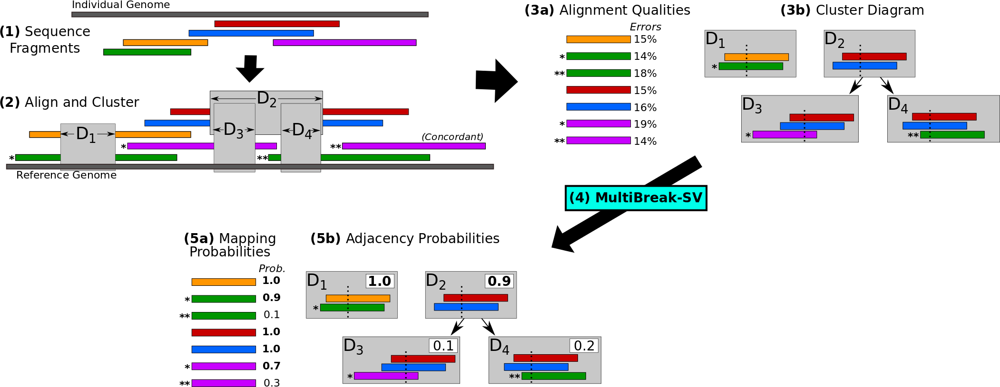

#MultiBreak-SV

## About
MultiBreak-SV identifies structural variants from next-generation paired end data, third-generation long read data, or data from a combination of sequencing platforms.

##Downloads 
You can download the latest version of MultiBreakSV from [GitHub](https://github.com/raphael-group/multibreak-sv).

NEW: We have released a pre-processor script that converts .m5 BLASR files to MultiBreak-SV input files.  It is available from [GitHub](https://github.com/raphael-group/multibreak-sv), and it requires [GASV](/projects/gasv) as an intermediate step.  

##References
MultiBreak-SV is described in the following publication:

> A. Ritz, A. Bashir, S. Sindi, D. Hsu, I. Hajirasouliha, B. J. Raphael (2014).
>Characterization of structural variants with single molecule and hybrid sequencing approaches.
>*Bioinformatics*. vol. 30 (24), pages 3458-3466.
>[[Publisher Link]](http://bioinformatics.oxfordjournals.org/content/30/24/3458.long)	

MultiBreak-SV was also presented at the 2014 ISMB special interest group satellite conference *HiTSeq: High Throughput Sequencing Algorithms & Applications* in Boston, MA on July 12, 2014.   

