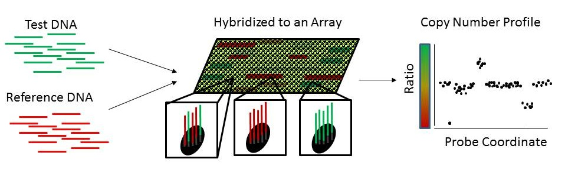

#NBC: Neighborhood Breakpoint Conservation

##About
Neighborhood Breakpoint Conservation (NBC) is a method that identifies recurrent copy number variants in multiple individuals using Array Comparative Genomic Hybridization (aCGH).

aCGH computes the ratio of test:reference DNA for probes located on the reference genome. NBC first uses a Bayesian changepoint algorithm to identify probes, called breakpoints, that change from low-to-high or high-to-low copy number with high probability. A binomial statistic is then applied to identify breakpoints and pairs of breakpoints that appear in a statistically significant number of individuals.

##Download
* Latest release: [NBCcode.tgz](http://compbio-research.cs.brown.edu/software/NBC/NBCcode.tgz)  
* Instructions: [README.txt](http://compbio-research.cs.brown.edu/software/NBC/README.txt)

##Reference
>A. Ritz, P.L. Paris, M.M. Ittmann, C. Collins, and B.J. Raphael. (2011)
>Detection of Recurrent Rearrangement Breakpoints from Copy Number Data.
>*BMC Bioinformatics*. [[Publisher Link]](http://www.biomedcentral.com/1471-2105/12/114/abstract)
