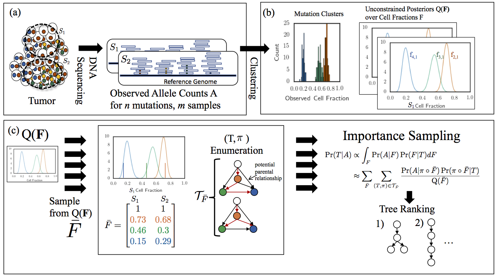

# PASTRI: Probabilistic Algorithm for Somatic TRee Inference

## About
PASTRI is an algorithm that infers tumor phylogenies from one or more bulk DNA sequencing samples. 

## Downloads 
You can download PASTRI from the [PASTRI GitHub Project](https://github.com/raphael-group/PASTRI).

