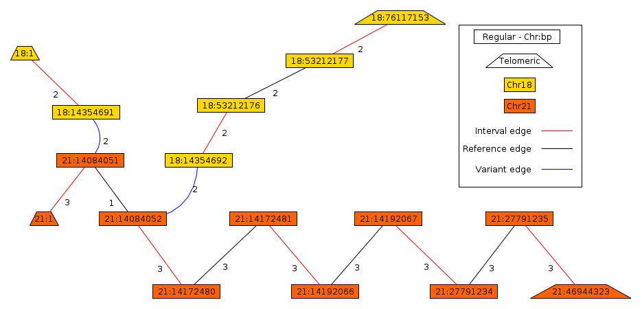

#PREGO: Paired-End Reconstruction of Genome Organization

##About
PREGO is an algorithm that reconstructs a cancer genome as a rearrangement of segments, or intervals, from the reference genome using paired-end sequencing data.

##Download
* Current Release: [PREGO Version 1.2 (5/29/2013)](http://cs.brown.edu/~braphael/software/PREGO/PREGO_1.2.tar.gz)

##Reference
The algorithm is described in the following paper:

>L. Oesper, A. Ritz, S.J. Aerni, R. Drebin, and B.J. Raphael. (2012)
>Reconstructing cancer genomes from paired-end sequencing data.
>*BMC Bioinformatics*. 13(Suppl 6):S10. [Publisher Link](http://www.biomedcentral.com/1471-2105/13/S6/S10)

Preliminary version accepted at 2nd Annual RECOMB Satellite Workshop on Massively Parallel Sequencing (RECOMB-seq)

##Previous versions
These are for archival purposes. It is recommended to download the latest version from the link above.

* PREGO Version 1.1: [Download](http://compbio.cs.brown.edu/software/PREGO/PREGO_1.1.tar.gz)
* PREGO Version 1.0: [Download](http://compbio.cs.brown.edu/software/PREGO/PREGO_1.0.tar.gz)