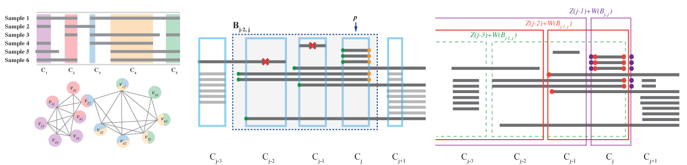

#RAIG: Recurrent Aberrations from Interval Graph

##About
RAIG is a combinatorial approach to the problem of identifying independent and recurrent copy number aberrations, focusing on the key challenging of separating the overlaps in aberrations across individuals into independent events.

##Downloads 
You can download the latest version of RAIG from [RAIG version 1.0](http://compbio-research.cs.brown.edu/software/RAIG/RAIG_1.0.tar.gz).

##References
THetA is described in the following publications:

>H. Wu, I. Hajirasouliha, B.J. Raphael (2014).
>Detecting independent and recurrent copy number aberrations using interval graphs. 
>*Bioinformatics*. vol. 30 ISMB2014, pages i195-i203.
>[[Publisher Link]](http://bioinformatics.oxfordjournals.org/content/30/12/i195.full.pdf)	

