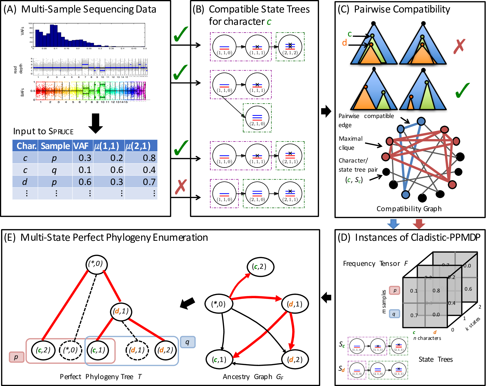

# SPRUCE: Somatic Phylogeny Reconstruction using Combinatorial Enumeration

## About
SPRUCE is an algorithm that infers a multi-state perfect phylogeny describing the evolutionary history of the somatic mutations (SNVs and CNVs) of a tumor given multi-sample bulk sequencing data. Specifically, the input to SPRUCE are variant allele frequencies and copy-number mixing proportions for each SNV in each sample. 

## Downloads 
You can download the latest version of SPRUCE from the [SPRUCE GitHub project](https://github.com/raphael-group/spruce).

## Support
For support, please see the [SPRUCE Google Group](https://groups.google.com/forum/#!forum/sprucealgorithm).

## References
SPRUCE is described in the following publications:

>M. El-Kebir, G. Satas, L. Oesper, and B.J. Raphael.
>Inferring the Mutational History of a Tumor using Multi-State Perfect Phylogeny Mixtures
>*Cell Systems*, (2016) 3(1):43-53.

>M. El-Kebir, G. Satas, L. Oesper, and B.J. Raphael.
>Multi-State Perfect Phylogeny Mixture Deconvolution and Applications to Cancer Sequencing
>*RECOMB 2016*.

