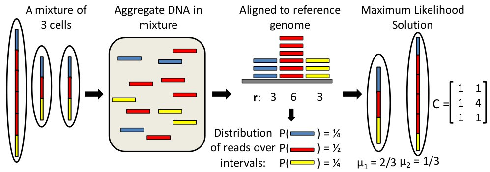

#THetA: Tumor Heterogeneity Analysis

##About
THetA (_T_umor _Het_erogeneity _A_nalysis) is an algorithm that estimates the tumor purity and clonal/sublconal copy number aberrations directly from high-throughput DNA sequencing data. The latest release is called THetA2 and includes a number of improvements over previous versions.

##Downloads 
You can download the latest version of THetA (now called THetA2) from the [THetA GitHub project](https://github.com/raphael-group/THetA).

##Support
For support, please see the [THetA Google Group](https://groups.google.com/forum/#!forum/theta-users).

##References
THetA2 is described in the following publication:

>L. Oesper, G. Satas, and B.J. Raphael. (2014)
>Quantifying Tumor Heterogeneity in Whole-Genome and Whole-Exome Sequencing Data.
>*Bioinformatics* 30 (24):3532-3540. [[Publisher Link](http://bioinformatics.oxfordjournals.org/cgi/reprint/btu651?
ijkey=RF0P6tuiK0dgmHr&keytype=ref)]

THetA is described in the following publications:

>L. Oesper, A. Mahmoody, and B.J. Raphael. (2013)
>Inferring Intra-Tumor Heterogeneity from High-Throughput DNA Sequencing Data. (Abstract)
>*Proceedings of the 17th Annual International Conference on Research in Computational Molecular Biology (RECOMB 2013)*, LNCS 7821, Pages 171-172.
>[[PDF]](http://link.springer.com/content/pdf/10.1007%2F978-3-642-37195-0_14.pdf)

>L. Oesper, A. Mahmoody, and B.J. Raphael. (2013)
>THetA: Inferring intra-tumor heterogeneity from high-throughput DNA sequencing data.
>*Genome Biology*. 14:R80. [[Publisher Link](http://genomebiology.com/2013/14/7/R80/abstract) | [Supplemental Material](http://genomebiology.com/content/supplementary/gb-2013-14-7-r80-s1.pdf)]

##Related Files
The THetA2 paper includes a likelihood model fo BAF which may be used to distinguish between multiple reconstruction returned using read depth only.  The latest release includes code to compute this likelihood model.  The following are support files which may be helpful when computing this likelihood model for observed BAFs.

* [Affymetrix SNP 6.0 Positions for hg18](http://compbio-research.cs.brown.edu/projects/theta/data/AffySNP6.0_hg18.txt.formatted)
* [Affymetrix SNP 6.0 Positions for hg19](http://compbio-research.cs.brown.edu/projects/theta/data/AffySNP6.0_hg19.txt.formatted)

Simulated data used in the THetA2 paper can be found [here](http://compbio-research.cs.brown.edu/projects/theta/simulations/).

##Previous versions
These are for archival purposes. It is strongly recommended to download the latest version from the link above.

* THetA 0.5 (9/10/2013): [Download](http://compbio-research.cs.brown.edu/software/THetA/THetA_0.5.tar.gz)
* THetA Beta 0.03 (6/14/2013): [Download](http://compbio-research.cs.brown.edu/software/THetA/THetA_Beta_0.03.tar.gz)
* THetA Beta 0.02 (1/22/2013): [Download](http://compbio-research.cs.brown.edu/software/THetA/THetA_Beta_0.02.tar.gz)
* THetA Beta 0.01 (10/18/2012): [Download](http://compbio-research.cs.brown.edu/software/THetA/Heterogeneity_Beta_0.01.tar.gz)
