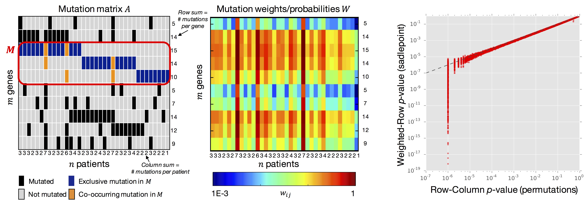

# Weighted Exclusivity Test (WExT)

## About
We developed a weighted exact test for mutually exclusive mutations, which conditions on the number of mutations in each gene and uses per gene, per sample mutation probabilities. We call this a _weighted-row exclusivity (WR-exclusivity) test_, because it conditions on the number of mutations per gene (row sums of mutation matrix) and uses per gene, per sample weights.

We use our WR-exclusivity test to approximate the row-column exclusivity (RC-exclusivity) test that conditions on the number of mutations per gene and per patient, but is too expensive computationally to compute exactly.

## Downloads and software
We use our Weighted Exclusivity Test (WExT) software to compute the WR-exclusivity test, either exactly or with a saddlepoint approximation. The software and source code is hosted on GitHub: [Source code](https://github.com/raphael-group/wext/) | [Downloads](https://github.com/raphael-group/wext/releases).

## References

> Mark D.M. Leiserson, Matthew A. Reyna, Benjamin J. Raphael. (2016) A Weighted Exact Test for Mutually Exclusive Mutations in Cancer. _ECCB/Bioinformatics_ (to appear). [arXiv preprint](https://arxiv.org/abs/1607.02447)
