#### [PubMed](http://www.ncbi.nlm.nih.gov/pubmed/?term=%28raphael+bj+%5Bau%5D+OR+raphael+bj+%5BInvestigator%5D%29+OR+21720365%5Buid%5D+OR+17048384+%5Buid%5D+OR+15520295+%5Buid%5D) | [DBLP](http://www.informatik.uni-trier.de/~ley/db/indices/a-tree/r/Raphael:Benjamin_J=.html)

# publications

### In press ###

* 
	**Copy-Number Evolution Problems: Complexity and Algorithms**

	_M. El-Kebir_, _B.J. Raphael_, R. Shamir, R. Sharan, _S. Zaccaria_, M. Zehavi, R. Zeira

	*WABI 2016*, (In Press)

* 
	**A Weighted Exact Test for Mutually Exclusive Mutations in Cancer**

	_M.D.M. Leiserson_, _M.A. Reyna_, _B.J. Raphael_

	*ECCB 2016/Bioinformatics*, (In Press) 
	
	
		<a href="http://compbio.cs.brown.edu/projects/wext" target="_new">Website</a>
	
	
		<a href="https://github.com/raphael-group/wext">Software Release</a>
	
	
        	<a href="http://arxiv.org/abs/1607.02447" target="_new">arXiv preprint</a>
    	

### 2016 ###

##### Journal Articles

* 
	**Inferring the Mutational History of a Tumor using Multi-State Perfect Phylogeny Mixtures**

	_M. El-Kebir*_, _G. Satas*_, _L. Oesper_, _B.J. Raphael_

	*Cell Systems*, (2016) 3(1):43-53.

	
		<a href="http://compbio.cs.brown.edu/projects/spruce" target="_new">Website</a>
	
	
		<a href="https://github.com/raphael-group/spruce">Software Release</a>
	

* 
	**On the Sample Complexity of Cancer Pathways Identification**

	_F. Vandin_, _B.J. Raphael_, E.Upfal.

	*Journal of Computational Biology*, (2016) 23(1):30-41.
	
##### Conference Proceedings

* 
	**Multi-State Perfect Phylogeny Mixture Deconvolution and Applications to Cancer Sequencing**

	_M. El-Kebir_, _G. Satas_, _L. Oesper_, _B.J. Raphael_

	*RECOMB 2016*

	
        <a href="http://arxiv.org/abs/1604.02605" target="_new">arXiv preprint</a>
    
    
### 2015 ###

##### Journal Articles

* 
	**Patterns and functional implications of rare germline variants across 12 cancer types**

	Lu C, Xie M, Wendl MC, Wang J, McLellan MD, _Leiserson MDM_, Huang KL, Wyczalkowski MA, Jayasinghe R, Banerjee T, Ning J, Tripathi P, Zhang Q, Niu B, Ye K, Schmidt HK, Fulton RS, McMichael JF, Batra P, Kandoth C, Bharadwaj M, Koboldt DC, Miller CA, Kanchi KL, Eldred JM, Larson DE, Welch JS, You M, Ozenberger BA, Govindan R, Walter MJ, Ellis MJ, Mardis ER, Graubert TA, Dipersio JF, Ley TJ, Wilson RK, Goodfellow PJ, _Raphael BJ_, Chen F, Johnson KJ, Parvin JD, Ding L.

	*Nature Communications*, (2015) 6:10086.

* 
        **Comprehensive Molecular Characterization of Papillary Renal-Cell Carcinoma**
    

	_The Cancer Genome Atlas Research Network_

	*New England Journal of Medicine*, (2015) (In press)

* 
        **Identification of hierarchical chromatin domains**
      

	_C. Weinreb_ and _B.J. Raphael_

	*Bioinformatics*, (2015) pii: btv485.

	
	      <a href="http://compbio.cs.brown.edu/projects/tadtree" target="_new">Website</a>
    

* [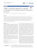](http://www.genomebiology.com/2015/16/1/160)
        **Comet: A Statistical Approach to Identify Combinations of Mutually Exclusive Alterations in Cancer**
       

	_M.D.M. Leiserson*_, _H-T. Wu*_, _F. Vandin_, _B.J. Raphael_
	
	*Genome Biology* (2015) 16:160.

	
		<a href="http://compbio.cs.brown.edu/projects/comet" target="_new">Website</a>
	
	
        <a href="https://github.com/raphael-group/comet">Software Release</a>
    
	
        <a href="http://arxiv.org/abs/1503.08224" target="_new">arXiv preprint</a>
    

* 
        **Universal and Domain-Specific Sequences in 23S-28S Ribosomal RNA Identified by Computational Phylogenetics.**
       

	S.M. Doris, D.R. Smith, J.N. Beamesderfer, _B.J. Raphael_,  J.A. Nathanson, S.A. Gerbi

	*RNA*, (2015) 21(10):1719-30.

* 
	**Reconstruction of clonal trees and tumor composition from multi-sample sequencing data.**

	_M. El-Kebir*_, _L. Oesper*_, _H. Acheson-Field_, _B.J. Raphael_

	*Bioinformatics (Special Issue: Proceedings of ISMB)*, (2015) 31(12):i62-i70.

	
		<a href="http://compbio.cs.brown.edu/projects/ancestree" target="_new">Website</a>
	
	
		<a href="https://github.com/raphael-group/AncesTree">Software Release</a>
	

* 
	**Pathway and network analysis of cancer genomes.**

	Mutation Consequences and Pathway Analysis working group of the International Cancer Genome Consortium

	*Nature Methods*, (2015) 12(7):615-621.

* [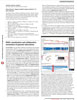](http://www.nature.com/nmeth/journal/v12/n6/full/nmeth.3412.html)
        **MAGI: visualization and collaborative annotation of genomic aberrations**
      

	_M.D.M Leiserson_, C.C. Gramazio, J. Hu, _H-T. Wu_, D.H. Laidlaw, _B.J Raphael_
	
	*Nature Methods*, (2015) 12(6):483-484.

	
		<a href="http://magi.brown.edu" target="_new">Website</a>
	
	
        <a href="https://github.com/raphael-group/magi">Software Release</a>
    

* 
	**Detecting non-allelic homologous recombination from high-throughput sequencing data.**

	_M. Parks_, C.E. Lawrence,_B.J. Raphael_

	*Genome Biology*, (2015) 8;16(1):72.

    
        <a href="https://github.com/mmp3/detect-NAHR">Software Release</a>
    

* 
        **Accurate Computation of Survival Statistics in Genome-wide Studies**
      

	_F. Vandin_, _A. Papoutsaki_, _B.J. Raphael*_, E. Upfal*
	
	*PLOS Computational Biology*, (2015) 11(5):e1004071.

* 
        **Simultaneous Inference of Cancer Pathways and Tumor Progression from Cross-Sectional Mutation Data**
      

	_B.J. Raphael_, _F. Vandin_
	
	*Journal of Computational Biology*, (2015) 22(6):510-27.

* [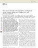](http://www.nature.com/ng/journal/v47/n2/full/ng.3168.html#)
        **Pan-cancer network analysis identifies combinations of rare somatic mutations across pathways and protein complexes**
      

	_M.D.M Leiserson*_, _F. Vandin*_, _H. Wu_, _J.R. Dobson_, _J.V. Eldridge_, _J.L. Thomas_, _A. Papoutsaki_, _Y. Kim_, B. Niu, M. McLellan, M.S. Lawrence, A. Gonzalez-Perez, D. Tamborero, Y. Cheng, G.A. Ryslik, N. Lopez-Bigas, G. Getz, L. Ding, _B.J Raphael_
	
	*Nature Genetics*, (2015) 47(2):106-114.

	
		<a href="http://compbio.cs.brown.edu/pancancer/hotnet2" target="_new">Website</a>
	
	
        <a href="https://github.com/raphael-group/hotnet2">Software Release</a>
    

##### Conference Proceedings
* [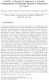](http://link.springer.com/chapter/10.1007%2F978-3-319-16706-0_19)
        **Comet: A Statistical Approach to Identify Combinations of Mutually Exclusive Alterations in Cancer**
      

	_M.D.M. Leiserson*_, _H-T. Wu*_, _F. Vandin_, _B.J. Raphael_
	
	*19th Annual International Conference on Research in Computational Molecular Biology (RECOMB 2015)*

	
		<a href="http://compbio.cs.brown.edu/projects/comet" target="_new">Website</a>
	
	
        <a href="https://github.com/raphael-group/comet">Software Release</a>
    
	
        <a href="http://arxiv.org/abs/1503.08224" target="_new">arXiv preprint</a>
    

* 
        **On the Sample Complexity of Cancer Pathways Identification**
         

	_F. Vandin_, _B.J. Raphael_, E. Upfal
	
	*19th Annual International Conference on Research in Computational Molecular Biology (RECOMB 2015)*  Lecture Notes in Computer Science Volume 9029, 2015, pp 326-337.

##### Book Chapters
* 
        **Analyzing Combinations of Somatic Mutations in Cancer Genomes**
	 
	_M.D.M. Leiserson_ and _B.J. Raphael_

	In *Integrating Omics Data* G.C.Tseng, D. Ghosh, X.J. Zhou (Eds).  Cambridge University Press (2015)

### 2014

##### Journal Articles
* 
        **Characterization of Structural Variants with Single Molecule and Hybrid Sequencing Approaches**
         

	_A Ritz_, A. Bashir, _S. Sindi_, D. Hsu, _I. Hajirasouliha_, _B.J. Raphael_
	
	*Bioinformatics*, (2014) 30(24):3458-66.

	
        <a href="https://github.com/raphael-group/multibreak-sv">Software Release</a>
    

* 
	**Quantifying Tumor Heterogeneity in Whole-Genome and Whole-Exome Sequencing Data**
	 

	_L. Oesper_, _G. Satas_, _B.J. Raphael_

	*Bioinformatics*, (2014) 30(24):3532-40. 

	
	<a href="/projects/theta#download">Software Release</a>
    
    
* 01238-0)
**Integrated Genomic Characterization of Papillary Thyroid Carcinoma**
 

	_The Cancer Genomic Atlas Research Network_
	
	*Cell*, (2014) 159(3):676-90.

* [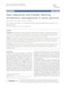](http://www.biomedcentral.com/1471-2164/15/S6/S4/abstract)

	**Open adjacencies and k-breaks: detecting simultaneous rearrangements in cancer genomes**
	 
	
	_C. Weinreb_, _L. Oesper_, _B.J. Raphael_

	*BMC Genomics*, (2014) 15(Suppl 6):S4.

	*Special issue for the 12th Annual Research in Computational Molecular Biology (RECOMB) Satellite Workshop on Comparative Genomics (RECOMB-CG 2014)*
	
	<a href="http://www.biomedcentral.com/1471-2164/15/S6/S4/" target="_new">PubLink</a>
	

* [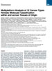](http://www.cell.com/cell/pdf/S0092-8674\(14\)00876-9.pdf)

	**Multiplatform Analysis of 12 Cancer Types Reveals Molecular Classification within and across Tissues of Origin**
	 
	K.A. Hoadley, C. Yau, D.M. Wolf, A.D. Cherniack, D. Tamborero, S. Ng, _M.D.M. Leiserson_, B. Niu, M.D. McLellan, V. Uzunangelov, J. Zhang, C. Kandoth, R. Akbani, H. Shen, L. Omberg, A. Chu, A.A. Margolin, L.J. van’t Veer, N. Lopez-Bigas, P.W. Laird, _B.J. Raphael_, L. Ding, A.G. Robertson, L.A. Byers, G.B. Mills, J.N. Weinstein, C. Van Waes, Z. Chen, E.A. Collisson, The Cancer Genome Atlas Research Network, C.C. Benz, C.M. Perou, J.M. Stuart

	*Cell*, 158(4):929-944.
	
        <a href="http://www.cell.com/cell/abstract/S0092-8674(14)00876-9" target="_new">PubLink</a>
    

* 
**Expanding the computational toolbox for mining cancer genomes.**
 

	L. Ding, M.C. Wendl, J.F. McMichael, _B.J. Raphael_
	
	*Nature Reviews Genetics.* (2014) 15(8):556-70.

* [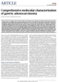](http://www.nature.com/nature/journal/v513/n7517/pdf/nature13480.pdf)
	**Comprehensive molecular characterization of gastric adenocarcinoma**
	
	The Cancer Genome Atlas Research Network

	*Nature* 513:202-209.

	
        <a href="http://www.nature.com/nature/journal/v513/n7517/full/nature13480.html?WT.ec_id=NATURE-20140911" target="_new">PubLink</a>
    

* [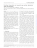](http://bioinformatics.oxfordjournals.org/content/30/12/i195.full)
	**Detecting independent and recurrent copy number aberrations using interval graphs**
	
	_H. Wu_, _I. Hajirasouliha_, _B.J. Raphael_

	*Bioinformatics 30 (12), i195-i203*.

	*Special issue for the 22nd Annual International Conference on Intelligent Systems in Molecular Biology (ISMB 2014)*

	
        <a href="http://bioinformatics.oxfordjournals.org/content/30/12/i195.full.pdf" target="_new">PubLink</a>
    
    
		<a href="http://compbio.cs.brown.edu/projects/raig" target="_new">Website</a>
	
	
        <a href="http://compbio-research.cs.brown.edu/software/RAIG/RAIG_1.02.tar.gz">Software Release</a>
    

* [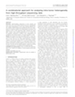](http://bioinformatics.oxfordjournals.org/content/30/12/i78.full)
	**A combinatorial approach for analyzing intra-tumor heterogeneity from high-throughput sequencing data**
	
	_I. Hajirasouliha_, _A. Mahmoody_, _B.J. Raphael_

	*Bioinformatics  30 (12), i78-i86*.

	*Special issue for the 22nd Annual International Conference on Intelligent Systems in Molecular Biology (ISMB 2014)*

	
        <a href="http://bioinformatics.oxfordjournals.org/content/30/12/i78.full.pdf" target="_new">PubLink</a>
    

* 
  	     **Expression profiling of primary and metastatic ovarian tumors reveals differences indicative of aggressive disease**

	A.S. Brodsky, A. Fischer, D.H. Miller, S.Vang, S.Maclaughlan, _H.T. Wu_, J.Yu, M.Steinhoff, C.Collins, P.J.Smith, _B.J. Raphael_, L.Brard

	*PLoS One.* (2014) 9(4):e94476.

* [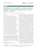](http://genomemedicine.com/content/6/1/5)
	**Identifying driver mutations in sequenced cancer genomes: computational approaches to enable precision medicine**

	_B.J. Raphael_, _J.R. Dobson_, _L. Oesper_, _F. Vandin_

	*Genome Medicine*

	
		<a href="http://compbio-research.cs.brown.edu/publications/papers/Raphael_etAl_IdentifyingDriverMutations_GM.pdf" target="_new">PDF</a>
	

* [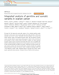](http://www.nature.com/ncomms/2014/140122/ncomms4156/pdf/ncomms4156.pdf) 
	**Integrated analysis of germline and somatic variants in ovarian cancer** 

	K.L. Kanchi, K.J. Johnson, C. Lu, M.D. McLellan, _M.D.M. Leiserson_, M.C. Wendl, Q. Zhang, D.C. Koboldt, M. Xie, C. Kandoth, J.F. McMichael, M.A. Wyczalkowski, D.E. Larson, H.K. Schmidt, C.A. Miller, R.S. Fulton, P.T. Spellman, E.R. Mardis, T.E. Druley, T.A Graubert, P.J. Goodfellow, _B.J. Raphael_, R. K. Wilson, L. Ding
	
	*Nature Communications* 

	
		<a href="http://www.nature.com/ncomms/2014/140122/ncomms4156/full/ncomms4156.html" target="_new">PubLink</a>
	

* 
	**Identification of Structural Variation** 

	S.S. Sindi, _B.J. Raphael_
	
	*Genome Analysis: Current Procedures* (In Press)

##### Conference Proceedings

*  
	**Reconstructing mutational history in multiply sampled tumors using perfect phylogeny mixtures**

	_I. Hajirasouliha_, _B.J. Raphael_
	
	*14th Workshop on Algorithms in Bioinformatics (WABI)* (2014) Lecture Notes in Computer Science Volume 8701, 2014, pp 354-367.

*  
	**Simultaneous Inference of Cancer Pathways and Tumor Progression from Cross-Sectional Mutation Data**

	_B.J. Raphael_, F. Vandin
	
	*18th Annual International Conference on Research in Computational Molecular Biology (RECOMB)* (2014) Lecture Notes in Computer Science Volume 8394, 2014, pp 250-264.

### 2013

##### Journal Articles

* [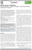](http://ac.els-cdn.com/S0959437X13001354/1-s2.0-S0959437X13001354-main.pdf?_tid=d320da4e-5b66-11e3-9f0a-00000aacb361&acdnat=1385998473_4bc4eccdd09fdf8108bc2e3004c36b9d) 
	**Network analysis of GWAS data** 

	_M.D.M. Leiserson_, _J.V. Eldridge_, S. Ramachandran, _B.J. Raphael_
	
	*Current Opinion in Genetics & Development* 

	
		<a href="http://www.sciencedirect.com/science/article/pii/S0959437X13001354" target="_new">PubLink</a>
	

* [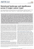](http://www.nature.com/nature/journal/v502/n7471/pdf/nature12634.pdf) 
	**Mutational landscape and significance across 12 major cancer types**

	C. Kandoth, M.D. McLellan, _F. Vandin_, K. Ye, B. Niu, C. Lu, M. Xie, Q. Zhang, J.F. McMichael, M.A. Wyczalkowski, _M.D.M. Leiserson_, C.A. Miller, J.S. Welch, M.J. Walter, M.C. Wendl, T.J. Ley, R.K. Wilson, _B.J. Raphael_, L. Ding
	
	*Nature*

	
		<a href="http://www.nature.com/nature/journal/v502/n7471/pdf/nature12634.pdf" target="_new">PubLink</a>
	

* [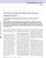](http://www.nature.com/ng/journal/v45/n10/pdf/ng.2764.pdf) 
	**The Cancer Genome Atlas Pan-Cancer analysis project**

	The Cancer Genome Atlas Research Network, J.N. Weinstein, E.A. Collisson, G.B. Mills, K.R. Mills Shaw, B.A. Ozenberger, K. Ellrott, I. Shmulevich, C. Sander, J.M. Stuart
	
	*Nature Genetics*

	
		<a href="http://www.nature.com/ng/journal/v45/n10/full/ng.2764.html" target="_new">PubLink</a>
	

* 
	**Making connections: using networks to stratify human tumors (News and Views)** 

	_B.J. Raphael_
	
	*Nature Methods*

	
		<a href="http://dx.doi.org/10.1038/nmeth.2704" target="_new">PubLink</a>
	

* [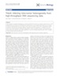](http://dx.doi.org/doi:10.1186/gb-2013-14-7-r80)
	**THetA: Inferring intra-tumor heterogeneity from high-throughput DNA sequencing data** 

	_L. Oesper_, _A. Mahmoody_, _B.J. Raphael_
	
	*Genome Biology*

	
		<a href="http://dx.doi.org/doi:10.1186/gb-2013-14-7-r80" target="_new">PubLink</a>
	
	
		<a href="/projects/theta#download">Software Release</a>
	

* 
	**Comprehensive molecular characterization of clear cell renal cell carcinoma** 

	The Cancer Genome Atlas Research Network
	
	*Nature*

	
		<a href="http://www.nature.com/nature/journal/v499/n7456/full/nature12222.html" target="_new">PubLink</a>
	

* 
	**The mutational landscape of adenoid cystic carcinoma** 

	Ho AS, Kannan K, Roy DM, Morris LG, Ganly I, Katabi N, Ramaswami D, Walsh LA, Eng S, Huse JT, Zhang J, Dolgalev I, Huberman K, Heguy A, Viale A, Drobnjak M, Leversha MA, Rice CE, Singh B, Iyer NG, Leemans CR, Bloemena E, Ferris RL, Seethala RR, Gross BE, Liang Y, Sinha R, Peng L, _Raphael BJ_, Turcan S, Gong Y, Schultz N, Kim S, Chiosea S, Shah JP, Sander C, Lee W, Chan TA
	
	*Nature Genetics*

	
		<a href="http://dx.doi.org/doi:10.1038/ng.2643" target="_new">PubLink</a>
	

* [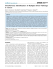](http://www.ploscompbiol.org/article/fetchObject.action?uri=info%3Adoi%2F10.1371%2Fjournal.pcbi.1003054&representation=PDF) 
	**Simultaneous Identification of Multiple Driver Pathways in Cancer**

	_M.D.M. Leiserson_, D. Blokh, R. Sharan, _B.J. Raphael_
	
	*PLoS Computational Biology*

	
		<a href="http://www.ploscompbiol.org/article/info%3Adoi%2F10.1371%2Fjournal.pcbi.1003054" target="_new">PubLink</a>
	
	
		<a href="https://github.com/raphael-group/multi-dendrix" target="_new">Software Release</a>
	
	
		<a href="http://compbio-research.cs.brown.edu/projects/multi-dendrix" target="_new">Website</a>
	

* 
	**Genomic and Epigenomic Landscapes of Adult De Novo Acute Myeloid Leukemia** 

	The Cancer Genome Atlas Research Network
	
	*New England Journal of Medicine*

	
		<a href="http://www.nejm.org/doi/full/10.1056/NEJMoa1301689" target="_new">PubLink</a>
	
	
		<a href="http://compbio-research.cs.brown.edu/aml_tcga/" target="_new">Interactive Visualization</a>
	

* 
	**Advances for Studying Clonal Evolution in Cancer** 

	L. Ding, _B.J. Raphael_, F. Chen, M.C. Wendl
	
	*Cancer Letters*

	
		<a href="http://dx.doi.org/10.1016/j.canlet.2012.12.028" target="_new">PubLink</a>
	

##### Conference Proceedings

* [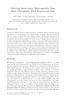](http://link.springer.com/chapter/10.1007%2F978-3-642-37195-0_14)
	**Inferring Intra-Tumor Heterogeneity from High-Throughput DNA Sequencing Data** 

	_L. Oesper_, _A. Mahmoody_, _B.J. Raphael_
	
	*17th Annual International Conference on Research in Computational Molecular Biology (RECOMB 2013)*

	
		<a href="http://link.springer.com/chapter/10.1007%2F978-3-642-37195-0_14" target="_new">PubLink</a>
	

* 
	**Genome-Wide Survival Analysis of Somatic Mutations in Cancer** 

	_F. Vandin_, _A. Papoutsaki_, _B.J. Raphael_, E. Upfal
	
	*17th Annual International Conference on Research in Computational Molecular Biology (RECOMB 2013)* &mdash; **Best Paper Award**

	
		<a href="http://link.springer.com/chapter/10.1007%2F978-3-642-37195-0_26" target="_new">PubLink</a>
	
	
		<a href="/projects/survival#download">Software Release</a>
	

* 
	**Modeling cell heterogeneity: from single-cell variations to mixed cells** 

	E. Batchelor, M.G. Kann, T.M. Przytycka, _B.J. Raphael_, D. Wojtowicz
	
	*Pacific Symposium on Biocomputing (PSB)*

	
		<a href="http://psb.stanford.edu/psb-online/proceedings/psb13/wkshp-modeling.pdf" target="_new">PubLink</a>
	

###2012

##### Journal Articles

* 
	**Structural Variation and Medical Genomics** 

	_B.J. Raphael_
	
	*PLOS Computational Biology*

	
		<a href="http://www.ploscompbiol.org/article/info%3Adoi%2F10.1371%2Fjournal.pcbi.1002821" target="_new">PubLink</a>
	

* 
	**Finding Driver Pathways in Cancer: Models and Algorithms** 

	_F. Vandin_, E. Upfal, _B.J. Raphael_
	
	*Algorithms for Molecular Biology*

	
		<a href="http://www.ploscompbiol.org/article/info%3Adoi%2F10.1371%2Fjournal.pcbi.1002821" target="_new">PubLink</a>
	

* 
	**Quantitative Phosphoproteomics Reveals SLP-76 Dependent Regulation of PAG and Src Family Kinases in T Cells** 

	L. Cao, Y. Ding, N. Hung, K. Yu, _A. Ritz_, _B.J. Raphael_, A.R. Salomon
	
	*PLOS One*

	
		<a href="http://www.plosone.org/article/info%3Adoi%2F10.1371%2Fjournal.pone.0046725" target="_new">PubLink</a>
	

* 
	**The genetics of alcohol dependence: Advancing towards systems-based approaches** 

	R.H. Palmer, J.E. McGeary, S. Francazio, _B.J. Raphael_, A.D. Lander, A.C. Heath, V.S. Knopik
	
	*Drug and Alcohol Dependence*

	
		<a href="http://dx.doi.org/10.1016/j.drugalcdep.2012.07.005" target="_new">PubLink</a>
	

* 
	**The Mutational Landscape of Lethal Castrate Resistant Prostate Cancer** 

	C. Grasso, Y. Wu, D. Robinson, X. Cao, S. Dhanasekaran, A. Khan, M. Quist, X. Jing, R. Lonigro, J.C. Brenner, I. Asangani, B. Ateeq, S. Chun, J. Siddiqui, L. Sam, M. Anstett, R. Mehra, J. Prensner, N. Palanisamy, G. Ryslik, _F. Vandin_, _B.J. Raphael_, L. Kunju, D. Rhodes, K. Pienta, A. M. Chinnaiyan, S.A. Tomlins
	
	*Nature*

	
		<a href="http://www.nature.com/nature/journal/v487/n7406/full/nature11125.html" target="_new">PubLink</a>
	

* 
	**An Integrative Probabilistic Model for Identification of Structural Variation in Sequencing Data** 

	_S. Sindi_, _S. Onal_, _L. Peng_, _H. Wu_, _B.J. Raphael_
	
	*Genome Biology*

	
		<a href="http://genomebiology.com/2012/13/3/R22/abstract" target="_new">PubLink</a>
	
	
		<a href="/projects/gasv#download">Software Release</a>
	

* 
	**Algorithms and Genome Sequencing: Identifying Driver Pathways in Cancer** 

	_F. Vandin_, E. Upfal, _B.J. Raphael_
	
	*IEEE Computer*

	
		<a href="http://compbio-research.cs.brown.edu/publications/papers/VandinUpfalRaphael_IEEEComputer.pdf" target="_new">PDF</a>
	

* 
	**Identification of Polymorphic Inversions from Genotypes** 

	A. Caceres, _S.S Sindi_, _B.J Raphael_, M. Caceres and J.R Gonzalez
	
	*BMC Bioinformatics*

	
		<a href="http://www.biomedcentral.com/1471-2105/13/28" target="_new">PubLink</a>
	

* 
	**De novo Discovery of Mutated Driver Pathways in Cancer** 

	_F. Vandin_, E. Upfal, _B.J. Raphael_
	
	*Genome Research*

	
		<a href="http://genome.cshlp.org/cgi/pmidlookup?view=long&pmid=21653252" target="_new">PubLink</a>
	
	
		<a href="/projects/dendrix#download">Software Release</a>
	

	[Preliminary version at 15th Annual International Conference on Research in Computational Molecular Biology (RECOMB 2011)]

##### Conference Proceedings

* 
	**Reconstructing Genome Mixtures From Partial Adjacencies** 

	_A. Mahmoody_, _C.L. Kahn_, _B.J. Raphael_
	
	*Proceedings of the Tenth Annual RECOMB Satellite Workshop on Comparative Genomics*

	
		<a href="http://www.biomedcentral.com/1471-2105/13/S19/S9" target="_new">PubLink</a>
	

* 
	**Algorithms in Bioinformatics - 12th International Workshop, WABI 2012, Ljubljana, Slovenia, September 10-12, 2012. Proceedings.** 

	_B.J. Raphael_, J. Tang (Eds.)
	
	*Lecture Notes in Computer Science*

	
		<a href="http://link.springer.com/book/10.1007/978-3-642-33122-0/page/1" target="_new">PubLink</a>
	

* [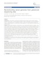](http://www.biomedcentral.com/1471-2105/13/S6/S10)
	**Reconstructing Cancer Genome Organization** 

	_L. Oesper_, _A. Ritz_, _S.J. Aerni_, _R. Drebin_, _B.J. Raphael_
	
	*BMC Bioinformatics (Proceedings of 2nd RECOMB Satellite Workshop on Massively Parallel Sequencing (RECOMB-seq))*

	
		<a href="http://www.biomedcentral.com/1471-2105/13/S6/S10" target="_new">PubLink</a>
	
	
		<a href="/projects/prego#download">Software Release</a>
	

* 
	**Discovery of Mutated Subnetworks Associated with Clinical Data in Cancer** 

	_F. Vandin_, _P. Clay_, E. Upfal, _B.J. Raphael_
	
	*Pacific Symposium on Biocomputing*

	
		<a href="http://psb.stanford.edu/psb-online/proceedings/psb12/vandin.pdf" target="_new">PDF</a>
	

###2011

##### Journal Articles

* 
	**Integrated Genomic Analyses of Ovarian Carcinoma** 

	The Cancer Genome Atlas Research Network
	
	*Nature*

	
		<a href="http://www.nature.com/nature/journal/v474/n7353/full/nature10166.html" target="_new">PubLink</a>
	

* 
	**Integrated Genomics of Ovarian Xenograft Tumor Progression and Chemotherapy Response** 

	A. Stuckey, A. Fischer, D.H. Miller, S. Hillenmeyer, K.K. Kim, _A. Ritz_, R.K. Singh, _B.J. Raphael_, L. Brard and A.S. Brodsky
	
	*BMC Cancer*

	
		<a href="http://www.biomedcentral.com/1471-2407/11/308" target="_new">PubLink</a>
	

* 
	**Using positional distribution to identify splicing elements and predict mRNA processing defects in human genes** 

	K.H. Lim, L. Ferraris, M. Filloux, _B.J. Raphael_, W. Fairbrother
	
	*Proceedings of the National Academy of Sciences (PNAS)*

	
		<a href="http://www.pnas.org/content/early/2011/06/06/1101135108.abstract" target="_new">PubLink</a>
	

* 
	**Detection of Recurrent Rearrangement Breakpoints from Copy Number Data** 

	_A. Ritz_, P.L. Paris, M.M. Ittmann, C. Collins, _B.J. Raphael_
	
	*BMC Bioinformatics*

	
		<a href="http://www.biomedcentral.com/1471-2105/12/114" target="_new">PubLink</a>
	
	
		<a href="/projects/nbc#download">Software Release</a>
	

* 
	**Algorithms for Detecting Significantly Mutated Pathways in Cancer** 

	_F. Vandin_, E. Upfal, _B.J. Raphael_
	
	*Journal of Computational Biology*

	
		<a href="http://dx.doi.org/10.1089/cmb.2010.0265" target="_new">PubLink</a>
	
	
		<a href="/projects/hotnet#download">Software Release</a>
	

##### Conference Proceedings

* 
	**Finding Driver Pathways in Cancer: Models and Algorithms** 

	_F. Vandin_, E. Upfal, _B.J. Raphael_
	
	*Proceedings of the 11th Workshop on Algorithms in Bioinformatics (WABI)*

###2010

##### Journal Articles

* 
	**Gremlin: An Interactive Visualization Model for Analyzing Genomic Rearrangements** 

	T. O'Brien, _A. Ritz_, _B.J. Raphael_, D.H. Laidlaw
	
	*IEEE Transactions on Visualization and Computer Graphics*

	
		<a href="http://www.computer.org/csdl/trans/tg/2010/06/ttg2010060918-abs.html" target="_new">PubLink</a>
	
	
		<a href="/projects/gremlin#download">Software Release</a>
	

* 
	**Parsimony and Likelihood Reconstruction of Human Segmental Duplications** 

	_C.L. Kahn_, _B.H. Hristov_, and _B.J. Raphael_
	
	*Bioinformatics*

	
		<a href="http://dx.doi.org/10.1093/bioinformatics/btq368" target="_new">PubLink</a>
	

	[Preliminary version at the 9th European Conference on Computational Biology (ECCB)

* 
	**International network of cancer genome projects** 

	International Cancer Genome Consortium
	
	*Nature*

	
		<a href="http://dx.doi.org/10.1038/nature08987" target="_new">PubLink</a>
	

* 
	**Structural Variation Analysis with Strobe Reads** 

	_A. Ritz_, A. Bashir, and _B.J. Raphael_
	
	*Bioinformatics*

	
		<a href="http://dx.doi.org/10.1093/bioinformatics/btq153" target="_new">PubLink</a>
	

* 
	**Identification and Frequency Estimation of Inversion Polymorphisms from Haplotype Data** 

	_S. Sindi_ and _B.J. Raphael_
	
	*Journal of Computational Biology*

	
		<a href="http://dx.doi.org/10.1089/cmb.2009.0185" target="_new">PubLink</a>
	

* 
	**Optimizing PCR assays for DNA based cancer diagnostics** 

	A. Bashir, Q. Liu, _B.J. Raphael_, D. Carson, Y.T. Liu, V. Bafna
	
	*Journal of Computational Biology*

	
		<a href="http://dx.doi.org/10.1089/cmb.2009.0203" target="_new">PubLink</a>
	

* 
	**Efficient Algorithms for Analyzing Segmental Duplications with Deletions and Inversions in Genomes** 

	_C.L. Kahn_, S. Mozes, and _B.J. Raphael_
	
	*Algorithms for Molecular Biology*

	
		<a href="http://www.almob.org/content/5/1/11" target="_new">PubLink</a>
	

##### Conference Proceedings

* 
	**Algorithms for Detecting Significantly Mutated Pathways in Cancer** 

	_F. Vandin_, E. Upfal, and _B.J. Raphael_
	
	*Proceedings of the 14th Annual International Conference on Research in Computational Molecular Biology (RECOMB 2010)*

	
		<a href="http://compbio-research.cs.brown.edu/publications/papers/VandinUpfalRaphael_RECOMB_2010.pdf" target="_new">PDF</a>
	

###2009

##### Journal Articles

* 
	**A New Approach for Quantitative Phosphoproteomic Dissection of Signaling Pathways Applied to T cell Receptor Activation** 

	V. Nguyen, L. Cao, J.T. Lin, N. Hung, _A. Ritz_, K. Yu, R. Jianu, S.P. Ulin, _B.J. Raphael_, D.H. Laidlaw, L.Brossay, A.R. Salomon 
	
	*Molecular Cell Proteomics*

	
		<a href="http://dx.doi.org/10.1074/mcp.8/11/2418" target="_new">PubLink</a>
	

* 
	**A Geometric Approach for Classification and Comparison of Structural Variants** 

	_S. Sindi_, E. Helman, A. Bashir, _B.J. Raphael_
	
	*Bioinformatics*

	
		<a href="http://dx.doi.org/10.1093/bioinformatics/btp208" target="_new">PubLink</a>
	

	[Special issue for the Joint 17th Annual International Conference on Intelligent Systems in Molecular Biology and 8th Annual International European Conference on Computational Biology (ISMB/ECCB 09)]

* 
	**Computational Identification Of CDR3 Sequence Archetypes Among Immunoglobulin Sequences in Chronic Lymphocytic Leukemia** 

	B.T Messmer, _B.J. Raphael_, S.J Aerni, G.F Widhopf, L.Z Rassenti, T.L Toy, T.J Kipps
	
	*Leukemia Research*

	
		<a href="http://dx.doi.org/10.1016/j.leukres.2008.05.022" target="_new">PubLink</a>
	

* 
	**Discovery of Phosphorylation Motif Mixtures in Phosphoproteomics Data** 

	_A. Ritz_, G. Shakhnarovich, A.R. Salomon, and _B.J. Raphael_
	
	*Bioinformatics*

	
		<a href="http://dx.doi.org/10.1093/bioinformatics/btn569" target="_new">PubLink</a>
	
	
		<a href="/projects/modl#download">Software Release</a>
	

##### Conference Proceedings

* 
	**Efficient Algorithms for Analyzing Segmental Duplications, Deletions, and Inversions in Genomes** 

	_C.L. Kahn_, S. Mozes, and _B.J. Raphael_
	
	*Proceedings of the 9th Workshop on Algorithms in Bioinformatics (WABI)*

	
		<a href="http://dx.doi.org/10.1007/978-3-642-04241-6_15" target="_new">PubLink</a>
	

* 
	**Identification and Frequency Estimation of Inversion Polymorphisms from Haplotype Data** 

	_S. Sindi_, _B.J. Raphael_
	
	*Proceedings of the 13th Annual International Conference on Research in Computational Molecular Biology (RECOMB)*

	
		<a href="http://dx.doi.org/10.1007/978-3-642-02008-7_30" target="_new">PubLink</a>
	

* 
	**Optimizing PCR assays for DNA based cancer diagnostics** 

	A. Bashir, Q. Liu, _B.J. Raphael_, D. Carson, Y.T. Liu, V. Bafna
	
	*Proceedings of the 13th Annual International Conference on Research in Computational Molecular Biology (RECOMB)*

	
		<a href="http://dx.doi.org/10.1007/978-3-642-02008-7_17" target="_new">PubLink</a>
	

* 
	**A Parsimony Approach to Analysis of Human Segmental Duplications** 

	_C.L. Kahn_, _B.J. Raphael_
	
	*Pacific Symposium on Biocomputing*

	
		<a href="http://psb.stanford.edu/psb-online/proceedings/psb09/kahn.pdf" target="_new">PubLink</a>
	
	
		<a href="http://compbio-research.cs.brown.edu/publications/papers/Kahn_camera_revised.pdf" target="_new">Corrected version</a>
	

###2008

##### Journal Articles

* 
	**Analysis of Segmental Duplications via Duplication Distance** 

	_C.L. Kahn_, _B.J. Raphael_
	
	*Bioinformatics (Proceedings of the European Conference on Computational Biology)*

	
		<a href="http://dx.doi.org/10.1093/bioinformatics/btn292" target="_new">PubLink</a>
	

* 
	**Evaluation of Paired-end Sequencing Strategies for Detection of Genome Rearrangements in Cancer** 

	A. Bashir, S. Volik, C.C. Collins, V. Bafna, _B.J. Raphael_
	
	*PLoS Computational Biology*

	
		<a href="http://dx.doi.org/10.1371/journal.pcbi.1000051" target="_new">PubLink</a>
	

* 
	**A sequence-based survey of the complex structural organization of tumor genomes** 

	_B.J. Raphael_, S. Volik, Guiqing Huang, F.Waldman, J. Costello, S.Aerni, R.P. Brown, A. Bashir, K. Pienta, G. Mills, K. Bajsarowicz, P. Paris, Q. Tao, W. Kuo, J.W. Gray, J. Cheng, M. Nefedov, P. de Jong, and C. Collins
	
	*Genome Biology*

	
		<a href="http://genomebiology.com/2008/9/3/R59" target="_new">PubLink</a>
	

* 
	**Classical Function Theory, Operator Dilation Theory, and Machine Computation on Multiply-Connected Domains** 

	J. Agler, J. Harland, _B.J. Raphael_
	
	*Memoirs of the American Mathematical Society*

	
		<a href="http://books.google.com/books?id=3rBUySnUI4QC&lpg=PP9&ots=m4ctgeaiPp&dq=benjamin%20raphael&lr=&pg=PP1#v=onepage&q=&f=false" target="_new">Google Books Link</a>
	

###2007

##### Journal Articles

* 
	**Optimization of primer design for the detection of variable genomic lesions in cancer** 

	A. Bashir A, Y.T. Liu, _B.J. Raphael_, D. Carson, V. Bafna
	
	*Bioinformatics*

	
		<a href="http://dx.doi.org/10.1093/bioinformatics/btm390" target="_new">PubLink</a>
	

* 
	**Quantitative Time-Resolved Phosphoproteomic Analysis of Mast Cell Signaling** 

	L. Cao, K. Yu, V. Nguyen, A. Ritz, _B.J. Raphael_, Y. Kawakami, T. Kawakami, A.R. Salomon
	
	*Journal of Immunology*

	
		<a href="http://www.jimmunol.org/cgi/content/abstract/179/9/5864" target="_new">PubLink</a>
	

* 
	**The *Sorcerer II* Global Ocean Sampling Expedition: Expanding the Universe of Protein Families** 

	S. Yooseph, G. Sutton, D.B. Rusch, A.L. Halpern, S.J. Williamson, K.Remington, J.A. Eisen, K..B. Heidelberg, G. Manning, W. Li, L. Jaroszewski, P. Cieplak, C.S. Miller, H. Li, S. T. Mashiyama, M. P. Joachimiak, C. van Belle, J. Chandonia, D. A. Soergel, Y. Zhai, K. Natarajan, S. Lee, _B.J. Raphael_, V. Bafna, R. Friedman, S. E. Brenner, A. Godzik, D. Eisenberg, J.E. Dixon, S. S. Taylor, R.L. Strausberg, M. Frazier, J.C. Venter
	
	*PLoS Biology*

	
		<a href="http://dx.doi.org/10.1371/journal.pbio.0050016" target="_new">PubLink</a>
	

* 
	**Analysis of Genomic Alterations in Cancer** 

	_B.J. Raphael_, S. Volik, C. Collins
	
	*Genome Sequencing Technology and Algorithms*, H. Tang, S. Kim, E. Mardis (eds)

	
		<a href="http://dx.doi.org/10.1371/journal.pbio.0050016" target="_new">PubLink</a>
	

##### Conference Proceedings

* 
	**Identifying Deletion Polymorphisms from Haplotypes** 

	E. Corona, _B.J. Raphael_, E. Eskin
	
	*Proceedings of the 11Th Annual International Conference on Research in Computational Biology (RECOMB 2007)*

	
		<a href="http://dx.doi.org/10.1007/978-3-540-71681-5_25" target="_new">PubLink</a>
	

###2006

##### Journal Articles

* 
	**Micro-inversions in Mammalian Evolution** 

	M. Chaisson, _B.J. Raphael_, and P. Pevzner
	
	*Proceedings of the National Academy of Sciences, USA*

	
		<a href="http://www.pnas.org/content/103/52/19824" target="_new">PubLink</a>
	

* 
	**Decoding the Fine-scale Structure of a Breast Cancer Genome and Transcriptome** 

	S. Volik, _B.J. Raphael_, et al.
	
	*Genome Research*

	
		<a href="http://genome.cshlp.org/cgi/content/full/16/3/394" target="_new">PubLink</a>
	

* 
	**AliWABA: Alignment on the Web through an A-Bruijn Approach** 

	N.C. Jones, D. Zhi, _B.J. Raphael_
	
	*Nucleic Acids Research*

	
		<a href="http://dx.doi.org/10.1093/nar/gkl288" target="_new">PubLink</a>
	

* 
	**Identifying Repeat Domains in Large Genomes** 

	D.Zhi, _B.J. Raphael_, A.Price, H. Tang, P. Pevzner 
	
	*Genome Biology*

	
		<a href="http://genomebiology.com/2006/7/1/R7" target="_new">PubLink</a>
	

##### Conference Proceedings

* 
	**Systems Biology and Regulatory Genomics. Joint Annual RECOMB 2005 Satellite Workshops on Systems Biology and on Regulatory Genomics** 

	E. Eskin, T. Ideker, _B.J. Raphael_, C. Workman (eds.)
	
	*Lecture Notes in Computer Science*

###2002 - 2005

##### Journal Articles

* 
	**Reconstructing Tumor Amplisomes** 

	_B.J. Raphael_, P. Pevzner 
	
	*Bioinformatics*

	
		<a href="http://dx.doi.org/10.1093/bioinformatics/bth931" target="_new">PubLink</a>
	

* 
	**A Novel Method for Multiple Alignment of Sequences with Repeated and Shuffled Domains** 

	_B.J. Raphael_, D. Zhi, H. Tang, P. Pevzner
	
	*Genome Research*

	
		<a href="http://genome.cshlp.org/cgi/content/full/14/11/2336" target="_new">PubLink</a>
	

* 
	**A Uniform Projection Method for the Motif Discovery Problem**

	_B.J. Raphael_, L. Liu, and G. Varghese
	
	*IEEE Transactions on Computational Biology and Bioinformatics*

	
		<a href="http://csdl.computer.org/comp/trans/tb/2004/02/n0091abs.htm" target="_new">PubLink</a>
	

* 
	**Reconstructing Tumor Genome Architectures**

	_B.J. Raphael_, S. Volik, C. Collins, P. Pevzner
	
	*Bioinformatics* (Special ECCB 2003 Issue)

	
		<a href="http://bioinformatics.oxfordjournals.org/cgi/content/abstract/19/suppl_2/ii162" target="_new">PubLink</a>
	

	[Recognized by the [Faculty of 1000](http://www.facultyof1000.com/)]

##### Other Publications

* 
	**A Computational Investigation Of Spectral Sets And Rational Dilations Over Multiply-Connected Domains**

	_B.J. Raphael_
	
	*Ph.D. Thesis*

	
		<a href="http://roger.ucsd.edu/record=b4374801~S9" target="_new">Link</a>
	
